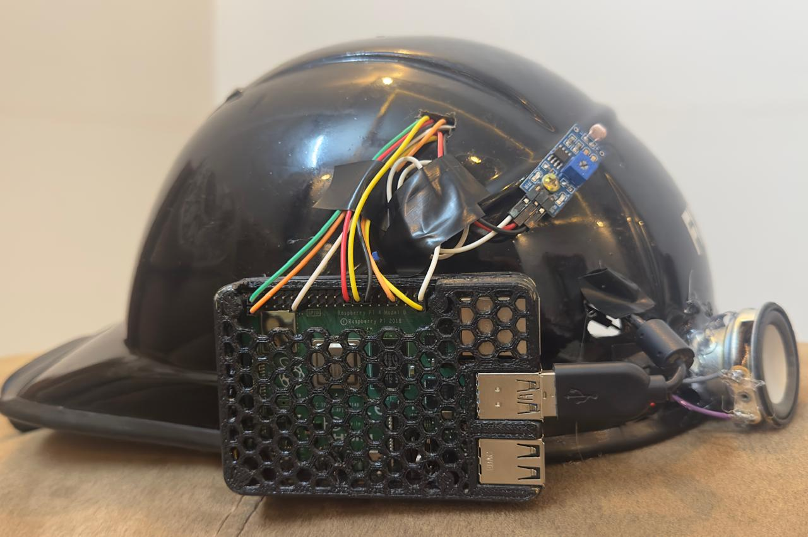

# AI-Driven Assistive Wearable Smart Cap for the Blind

## 🌟 Overview

The AI-Driven Assistive Wearable Smart Cap is a smart wearable device designed to assist visually impaired individuals through real-time object detection and voice feedback.

The system uses a Raspberry Pi, USB camera, and the YOLO object detection algorithm to identify nearby objects and provide audio alerts. It also includes ambient light and temperature sensing to improve environmental awareness and support safer navigation.

---

## 🎯 Problem Statement

Visually impaired individuals often face challenges in detecting obstacles, identifying surrounding objects, and navigating independently. Traditional mobility aids provide limited environmental information and may not be sufficient in complex environments.

This project aims to develop an affordable and intelligent wearable solution that uses Artificial Intelligence and Computer Vision to improve mobility, safety, and independence.

---

## 🚀 Objectives

* Develop a wearable assistive device for visually impaired users.
* Implement real-time object detection using YOLO.
* Provide voice-based feedback for detected objects.
* Monitor ambient light conditions using an LDR sensor.
* Measure environmental temperature using a DS18B20 sensor.
* Create a low-cost solution using Raspberry Pi.

---
## 📸 Project Images

### Smart Cap Prototype

### Project Demonstration

.jpg)
## 🛠 Hardware Components

* Raspberry Pi 4 Model B
* USB Webcam
* LDR Sensor
* DS18B20 Temperature Sensor
* Speaker
* Push Buttons
* Power Supply

---

## 💻 Software Components

* Python
* OpenCV
* YOLO Object Detection Algorithm
* Thonny IDE
* Text-to-Speech Engine

---

## ⚙️ System Workflow

1. The camera captures live images from the environment.
2. Raspberry Pi processes the captured image.
3. YOLO detects and classifies nearby objects.
4. The detected object names are converted into speech.
5. Audio feedback is delivered through a speaker or earphones.
6. Light and temperature sensors provide additional environmental information.

---

## 🧠 Working Principle

The camera continuously captures the user's surroundings. The YOLO model analyzes each image and identifies objects such as people, vehicles, chairs, laptops, doors, and other obstacles.

The Raspberry Pi processes the detection results and converts them into voice messages using a text-to-speech engine. These messages help the user understand the surrounding environment and navigate more safely.

The integrated sensors provide information about ambient light conditions and temperature, further improving environmental awareness.

---

## 📊 Results

The system successfully demonstrates:

* Real-time object detection
* Voice-based object announcements
* Ambient light detection
* Temperature monitoring
* Offline operation without internet connectivity
* Improved environmental awareness for visually impaired users

---

## 🎯 Applications

* Assistive technology for visually impaired individuals
* Smart wearable devices
* Embedded AI systems
* Computer Vision applications
* Raspberry Pi projects
* Accessibility-focused technology solutions

---

## ✅ Advantages

* Improves independent navigation
* Enhances user safety
* Lightweight and portable design
* Affordable implementation
* Easy to use
* Operates without continuous internet access

---

## 🔮 Future Enhancements

* GPS-based navigation assistance
* Face recognition
* Emergency SOS feature
* Mobile application integration
* Distance estimation for detected objects
* Improved low-light detection

---

## 🧰 Technologies Used

* Raspberry Pi
* Python
* OpenCV
* YOLO
* Artificial Intelligence
* Computer Vision
* Embedded Systems
* Internet of Things (IoT)

---

## 📌 Conclusion

This project demonstrates the successful integration of Artificial Intelligence, Computer Vision, and Embedded Systems to create an assistive wearable solution for visually impaired individuals.

By combining Raspberry Pi, YOLO object detection, environmental sensors, and voice feedback, the system provides real-time awareness of the surroundings and supports safer, more independent navigation.
ired individuals using Raspberry Pi, YOLO object detection and voice feedback.
